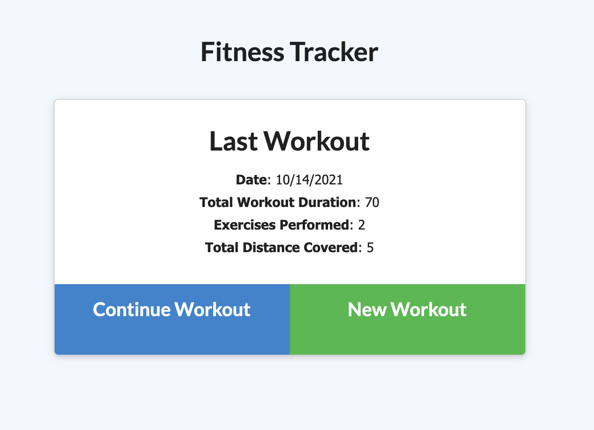

# <ins>Fitness Tracker</ins>

## <ins>Description</ins>

A consumer will reach their fitness goals more quickly when they track their workout progress.

## <ins>Table of Contents</ins>

- [Installation](#installation)
- [Usage](#usage)
- [License](#license)
- [Features](#features)
- [Contributions](#contributions)
- [Tests](#tests)
- [Questions](#questions)

## <ins>Installation</ins>

npm i, mongod

## <ins>Usage</ins>

As a user, I want to be able to view create and track daily workouts. I want to be able to log multiple exercises in a workout on a given day. I should also be able to track the name, type, weight, sets, reps, and duration of exercise. If the exercise is a cardio exercise, I should be able to track my distance traveled.

### [Check out the Fitness Tracker!](https://cryptic-river-66312.herokuapp.com/?id=61686b80370db300163922ce)

## <ins>License</ins>

This project is covered under MIT

## <ins>Features</ins>

- Add a new workout

- Continue a workout

- See last workout

- Track your progress

## <ins>Contributions

- [xBOBOYx](https://github.com/xBOBOYx)

## <ins>Tests</ins>

no testing done

## <ins>Questions</ins>

Contact BOBOY at boboy.zamora@gmail.com. Github link: https://github.com/xBOBOYx
